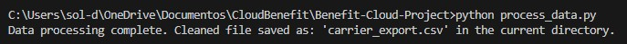

# Benefit Cloud Project - Engineering Project
Autor: Solange Correa

## 📌Overview
This project walks through a simplified version of how HR data gets cleaned, normalized, and prepared before it's sent to an insurance carrier. I built a small Python script that acts like a mini-pipeline.

1.- Reads the HRIS inbound file(**employees_inbound.csv**)
2.- Cleans and standardizes the messy data(**dates,SSNs, plan names**)
3.- Maps all of the inconsistent plan names into the correct **carrier plan categories**
4.- Generates a clean final export file(**carrier_export.csv**) that follows the carrier requirements

The result:
* Cleaning and preparing real-world data
* Working with inconsistent formats
* Handling imperfect or missing values
* Building something clear, logical and easy to maintain

My goal for this project is keep the code readable, organized, and structured in a way where another engineer could walk through it without any difficult in the syntaxis of the code.

# 🧹 Data Cleaning

### SSN

* The inbound file had SSNs with dashes and other symbols. I removed anything that wasn’t a number and kept only rows that had exactly 9 digits.
**Example:**
123-45-6789 → 123456789

### Dates

One of the biggest challenges was that dates were in many different formats that I set in the inbound file:

* 1988/9/5

* 2023-2-28

* 1976/3/3

* 1981-9-9

Since I’m using Pandas 2.x, I used: **format='mixed'**

This allowed all the different formats to be converted correctly. Then I reformatted everything to: **YYYY-MM-DD**

### Plan Names

* The project provided 15 messy plan names. I built a dictionary that maps all those variations into the 6 final clean plan names (Medical PPO, Medical HDHP, Dental Basic, Dental Premium, Vision Core, Vision Premium).

* If the plan couldn’t be mapped (like FSA plans), I removed the row.

#### Names

I also created a **clean Name** column by combining first and last names.

### 🗂 Final Output

The final file carrier_export.csv includes:

* MemberID

* Full Name

* Cleaned DOB

* Clean 9-digit SSN

* Clean Plan Name

* Coverage

* Effective Date

Everything is formatted and ready for a carrier import.

### ❗ How Invalid/Missing Data Was Handled

**I removed rows when:** 
* SSN was not 9 digits
* Plan name didn’t match any valid category
* A date couldn’t be converted even with mixed formatting
This keeps the export file clean and consistent.

### 📁 Files Included

* employees_inbound.csv – Original messy HRIS file
* process_data.py – Python script that cleans and normalizes the data
* carrier_export.csv – Final cleaned carrier file
* README.md – Project explanation

### Assumptions

Terminated employees are still included unless stated otherwise.
Some DOBs are missing in the inbound file, so those remain blank.
FSA plans were excluded since they don’t belong to the final plan groups.

#### ▶ How to Run
1. Install Pandas
If you don’t have Pandas installed, run: **pip install pandas**

2. Run the Script: **python process_data.py**

### OUTPUT
This will create carrier_export.csv in the same directory.

